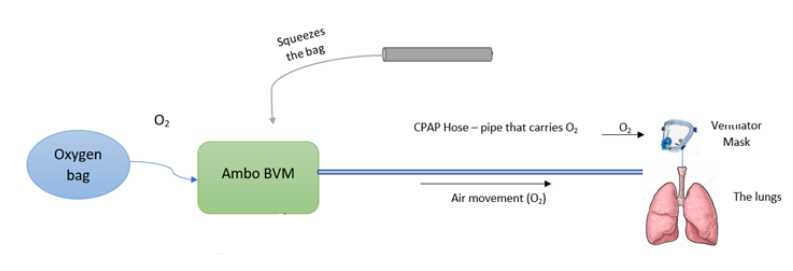
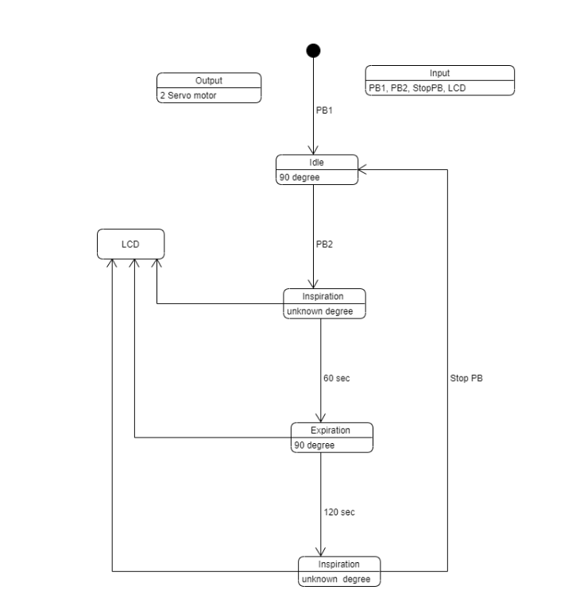
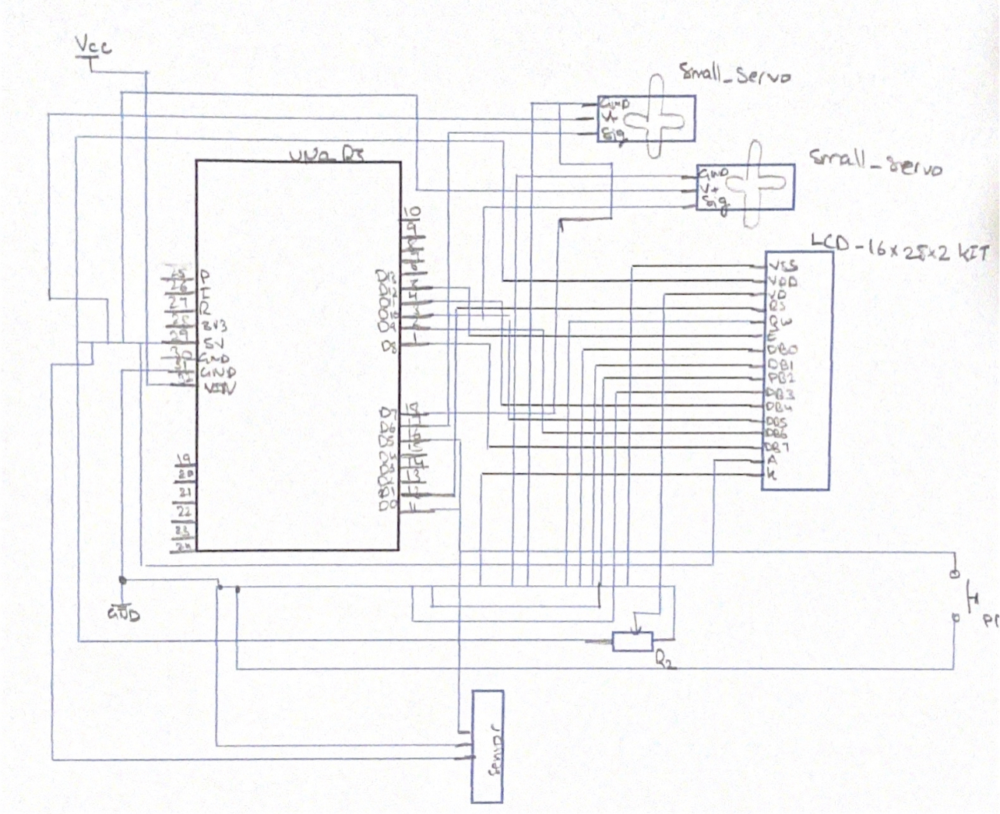
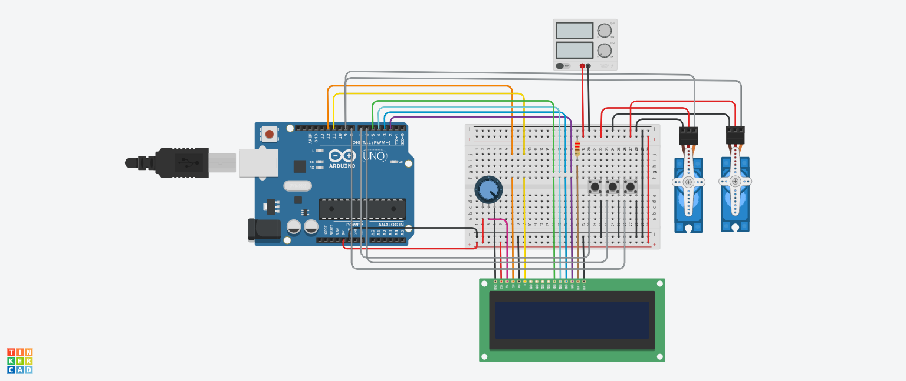
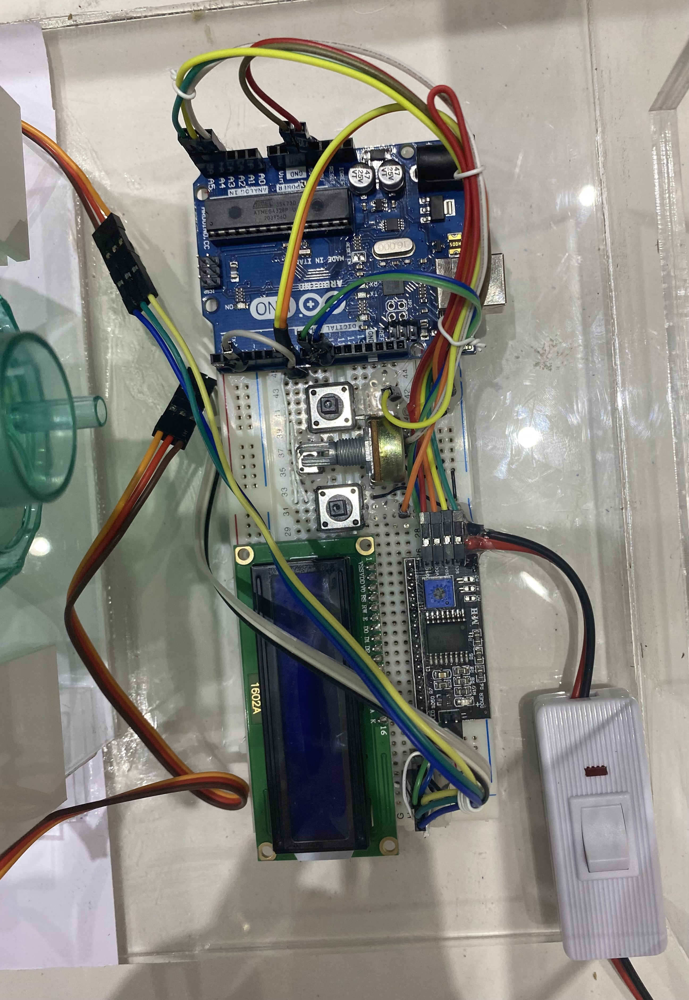
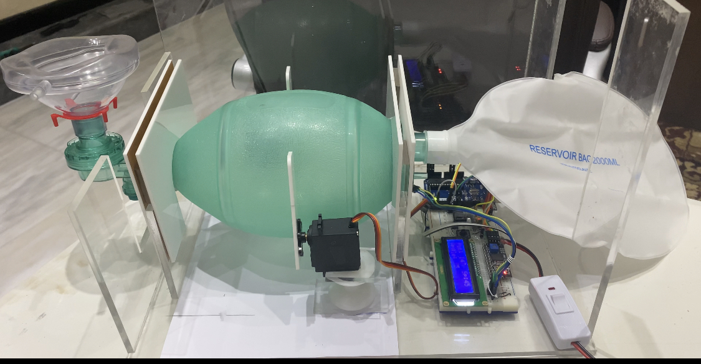

# Arduino Ventilator System

## Overview

This project presents an **Arduino-based ventilator system** designed to simulate a mechanical ventilation process. It focuses on developing a **low-cost**, **portable**, and **easy-to-assemble** ventilator to assist individuals with breathing difficulties, particularly in emergency scenarios like the COVID-19 pandemic.

The ventilator system operates using an **AMBU BVM Manual Breathing Balloon**, controlled by two **servo motors**, an **Arduino UNO board**, and additional components.

## System Overview

---

## Features

| Feature                   | Description                                             |
| ------------------------- | ------------------------------------------------------- |
| **LCD Display Interface** | Displays motor speed and angle.                         |
| **Control System**        | Potentiometer-based control with three push buttons.    |
| **Servo Motor Operation** | Drives the breathing bag mechanism.                     |
| **Safety and Usability**  | Portable, easy to assemble, and safe for operation.     |
| **Cost-Effective**        | Designed under $100 using readily available components. |

---

## Components Used

- **Arduino UNO Board**
- **Two Servo Motors**
- **I2C Type 16x2 LCD Screen**
- **Three Push Buttons**
- **Switch**
- **5V Power Supply**
- **Potentiometer**
- **AMBU BVM Manual Breathing Balloon**
- **Acrylic Arm for Motor**

---

## Design and Implementation

### 1. Ventilator Finite State Machine (FSM)

The system transitions between different states based on push-button inputs.

#### FSM Operating Modes:

1. **Idle Mode** – The system remains in standby when powered.
2. **Inspiration Mode** – The first button press starts the ventilator, compressing the breathing bag.
3. **Expiration Mode** – The second button allows exhalation.
4. **Cycle Repeat** – The system can be stopped or restarted using the buttons.

---

### 2. Hardware Design

#### **Ventilator System Hardware Schematic**

The schematic diagram illustrates the interconnections between all components.

#### **TinkerCAD Circuit Design**

Before physical implementation, the system was simulated using TinkerCAD to ensure functionality.

🔗 **[View TinkerCAD Circuit](https://www.tinkercad.com/things/kiPiG6pM5Oc-bme325-final-project-circuit)**  
📁 **[Download Circuit Board (.brd)](./CIRCUIT.brd)**

#### **Hardware Circuit**

The system integrates an **Arduino UNO**, **servo motors**, **LCD**, and other components to control the breathing mechanism. Below is the hardware circuit connections diagram:

📄 **[View Hardware Circuit Diagram](./DIAGRAM.pdf)**

---

## Software Implementation

- **Development Environment:** Arduino IDE
- **FSM Logic:** Manages smooth transitions between ventilator states
- **LCD Display:** Shows real-time speed and angle of the servo motor
- **Required Libraries:** Ensure `I2C LCD` and `Servo` libraries are installed

📄 **Source Code:** Available in `code.txt`

---

## Running the System

### **Setup Instructions**

1. Assemble the circuit as described in the **Hardware Design** section.
2. Connect all components (Arduino, servo motors, LCD, push buttons, etc.).
3. Power the system using a **5V power supply**.

### **Operating Instructions**

- **Start Button:** Begins **Inspiration Mode** (bag compression).
- **Stop Button:** Pauses the system.
- **Second Button:** Switches between **Inspiration** and **Expiration** modes.
- **LCD Readings:** Displays real-time **motor speed** and **angle**.

---

## Final Product & Demonstration

🎥 **Demo Video:** [Click to Watch](./demo.mp4)

---

## License & Copyright

This project is licensed under the **MIT License**.

You are free to use, modify, and distribute this project for **educational and research purposes**, but proper credit must be given to the original author **(Noora-Alhajeri)**.

### **Copyright Notice**

© 2024 **Noora-Alhajeri**. All rights reserved.

Originally Developed: **November 27, 2021**  
Uploaded to GitHub: **2024**

---

## Contact

For questions or collaboration, feel free to reach out:

📧 **Email:** [n.s3eedalhajeri@gmail.com](mailto:n.s3eedalhajeri@gmail.com)  
🌐 **LinkedIn:** [Noora-Alhajeri](https://www.linkedin.com/in/nsh-019)
